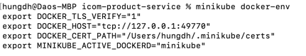
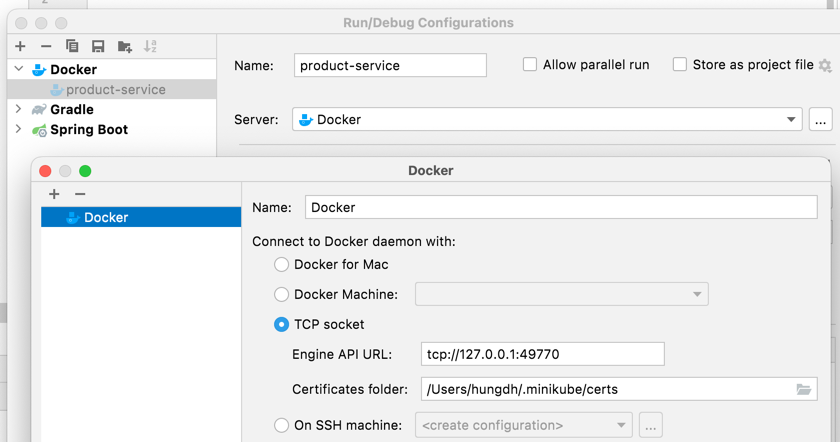

# icom-product-service

Guide to setup environment
1) Install local developement k8s
Requirments & setup guide: https://minikube.sigs.k8s.io/docs/start/

curl -LO https://storage.googleapis.com/minikube/releases/latest/minikube-darwin-amd64
sudo install minikube-darwin-amd64 /usr/local/bin/minikube

2) dashboard & tunnel
show k8s dashboards: minikube dashboard
use tunnel to access service (type: LoadBalancer) inside minikube: https://minikube.sigs.k8s.io/docs/handbook/accessing/
Known issue with network on MacOS: https://github.com/kubernetes/minikube/issues/11193

3) Setup local
Intellj plugin https://plugins.jetbrains.com/plugin/10485-kubernetes
Developer environment: https://stackoverflow.com/questions/42564058/how-to-use-local-docker-images-with-minikube
- Run in your terminal: eval $(minikube docker-env)

- Configure Intellj

4) Access service deployed inside minikube
minikube tunnel
kubectl get svc --> get external ip and port